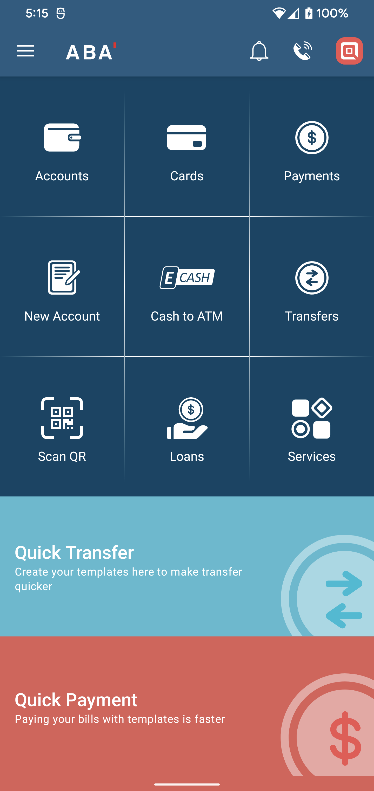

# ABAUIClone
An Android UI clone of ABA Mobile app for education purpose only.

# Project Specs 
  - Language: Android
  - UI Design system: XML-based
  - Design pattern: MVVM
  
# Screenshots: 

   

# Disclaimer 
This clone is built just to showcase Android UI design and a practice in MVVM design pattern for education purpose only.
